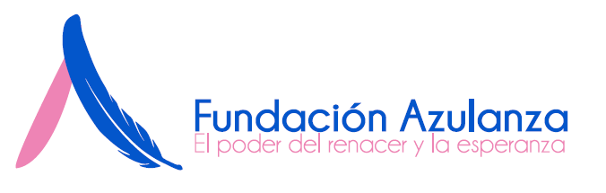

<div align="center">

  

  # 💙 Fundación Azulanza
  ### Plataforma Integral de Gestión Humanitaria

  <p align="center">
    <a href="#-visión-general">Visión General</a> •
    <a href="#-características">Características</a> •
    <a href="#-stack-tecnológico">Tecnología</a> •
    <a href="#-instalación">Instalación</a> •
    <a href="#-documentación">Documentación</a>
  </p>

  [](https://reactjs.org/)
  [](https://www.typescriptlang.org/)
  [](https://tailwindcss.com/)
  [](https://vitejs.dev/)
  [](https://supabase.com/)

  ---
</div>

## 🌟 Visión General

**Fundación Azulanza** no es solo un sitio web, es el corazón digital de nuestra misión humanitaria. Esta plataforma moderna conecta a donantes, voluntarios y beneficiarios en un ecosistema fluido y seguro.

Diseñada con **pasión** y **tecnología de punta**, permite gestionar desde donaciones en tiempo real hasta la coordinación de voluntariado y asesorías psicológicas, todo bajo una interfaz intuitiva y adaptable.

---

## ✨ Características

<details>
<summary><b>� Portal Público (Frontend)</b></summary>

*   **🎨 Diseño UI/UX Premium**: Interfaz limpia con animaciones suaves (`Framer Motion`) que guían al usuario.
*   **📱 Totalmente Responsivo**: Experiencia perfecta en móviles, tablets y escritorio.
*   **🌓 Modo Oscuro/Claro**: Adaptabilidad visual automática o manual para comodidad del usuario.
*   **🖼️ Galería Inmersiva**: Visualización de eventos y actividades con carga optimizada.
*   **📝 Formularios Dinámicos**: Inscripción de voluntarios y solicitud de citas con validación en tiempo real.

</details>

<details>
<summary><b>🛡️ Panel Administrativo (CMS)</b></summary>

*   **🔐 Seguridad Robusta**: Autenticación protegida y gestión de sesiones.
*   **📊 Dashboard en Tiempo Real**: Métricas clave de impacto (donaciones, voluntarios, citas).
*   **✏️ Editor de Contenido**: Gestión del slider principal, noticias y páginas sin tocar código.
*   **📂 Gestión de Archivos**: Subida y administración de imágenes (Drag & Drop) con Supabase Storage.
*   **📄 Reportes Exportables**: Generación de informes en **PDF** y **Excel** con un solo clic.

</details>

---

## 🚀 Stack Tecnológico

El proyecto está construido sobre una arquitectura moderna, escalable y mantenible.

| Área | Tecnología | Propósito |
| :--- | :--- | :--- |
| **Frontend** |  | Biblioteca de UI basada en componentes. |
| **Lenguaje** |  | Tipado estático para código robusto. |
| **Estilos** |  | Diseño rápido y consistente. |
| **Backend** |  | Base de datos, Auth y Storage (BaaS). |
| **Build** |  | Empaquetado ultrarrápido. |
| **Iconos** |  | Iconografía moderna y ligera. |

---

## ⚡ Instalación Rápida

¿Listo para desplegar? Sigue estos pasos para tener tu entorno local funcionando en minutos.

### 1. Clonar el repositorio
```bash
git clone https://github.com/JDProgramer802/fundacionazulanza.git
cd fundacionazulanza
```

### 2. Instalar dependencias
```bash
npm install
# o
yarn install
```

### 3. Configurar entorno
Crea un archivo `.env` en la raíz basado en el ejemplo:
```env
VITE_SUPABASE_URL=tu_url_de_supabase
VITE_SUPABASE_ANON_KEY=tu_clave_anonima
```

### 4. Iniciar desarrollo
```bash
npm run dev
```
> Visita `http://localhost:5173` y ¡listo! 🎉

---

## � Documentación Técnica

Para una inmersión profunda en el código y la arquitectura, consulta nuestra documentación detallada:

*   🏗️ [**Arquitectura del Sistema**](./docs/ARCHITECTURE.md) - Diagramas y esquemas de BD.
*   💻 [**Guía de Desarrollo**](./docs/DEVELOPMENT.md) - Standards y workflows.
*   🚀 [**Despliegue**](./docs/DEPLOYMENT.md) - Cómo llevarlo a producción.
*   📦 [**Dependencias**](./docs/DEPENDENCIES.md) - Inventario de librerías.
*   📖 [**Glosario**](./docs/GLOSSARY.md) - Términos técnicos.

---

## 📂 Estructura del Proyecto

Una vista rápida de cómo organizamos nuestro código:

```
src/
├── 📂 assets/          # Recursos estáticos (imágenes, logos)
├── 📂 components/      # Bloques de construcción UI
│   ├── 📂 Layout/      # Estructuras base (Admin, Public)
│   └── 📂 UI/          # Átomos (Botones, Inputs, Modales)
├── 📂 context/         # Estado global (Auth, Theme)
├── 📂 hooks/           # Lógica reutilizable (useAuth, useExport)
├── 📂 lib/             # Configuración de servicios externos
├── 📂 pages/           # Vistas de la aplicación
│   ├── 📂 Admin/       # Panel de control protegido
│   └── 📂 ...          # Páginas públicas
└── 📜 App.tsx          # Enrutador principal
```

---

<div align="center">

  ### ¿Te gusta este proyecto?
  ¡Dale una ⭐ en GitHub!

  <sub>Desarrollado con ❤️ para la Fundación Azulanza</sub>

</div>
